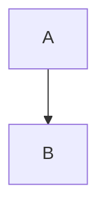

# Streamlit Mermaid Support

## Issue: `st.mermaid()` Not Available

In the latest versions of Streamlit, there is no built-in `st.mermaid()` function for rendering Mermaid diagrams.

## Solutions

There are two ways to display Mermaid diagrams in Streamlit:

### 1. Standard Markdown Approach

```python
# Use standard markdown for Mermaid diagrams
st.markdown("""

""")
```

### 2. Using the streamlit-mermaid Component

Install the package:
```bash
pip install streamlit-mermaid
```

Import and use it:
```python
import streamlit_mermaid as stmd

# Your Mermaid code
code = """
graph TD
    A --> B
"""

# Render the diagram
stmd.st_mermaid(code)
```

## Requirements

- For the component approach, `streamlit-mermaid` package must be installed in the same Python environment where Streamlit is running.
- Both approaches generally require a modern browser with JavaScript enabled.

## Tips

- The component approach typically offers better styling and interactivity.
- The markdown approach works with standard Streamlit without additional dependencies.
- If you're deploying to Streamlit Cloud, make sure to include `streamlit-mermaid` in your requirements.txt file if using the component approach.